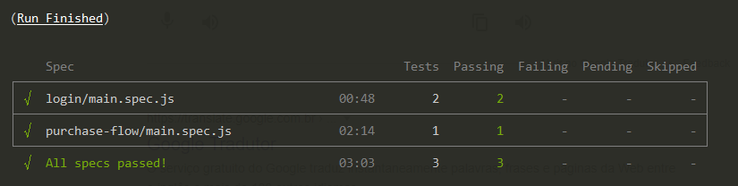

# Desafio Técnico

## Pré Requisito
 - Ter Instalado o node.js na sua máquina
 - Pode realizar o download por aqui: https://nodejs.org/en/download/

## Após ter instalado o nodejs

- 1º: clonar o projeto do github
- 2º: executar o comando "npm install" dentro da pasta clonada, para installar todas as dependências do projeto

## Variáveis de Ambiente 
 - Nesses testes temos conteúdos sensiveis, então tivemos a necessidade de criar as variaveis de ambiente
 - Na raiz do projeto, criar o arquivo com o nome: cypress.env.json;
 - Neste arquivo deve ser adicionadas o padrão de estrutura apresentada no arquivo "cypress.env.exemple.txt"

##
 - "TIMEOUT": Deve passar um valor em milisegungos, exemplo: 10000, para aguardar em até 10s.
    "EMAIL": Deve ter uma conta pré criada, informar seu email aqui.
    "SENHA": Informar a senha correta do respectivo email.
    

# Como executar os testes

## Modo Open
    - Para acompanhar a execução, no terminal execute o comando:
    npm run test:open
    

## Modo Headless
- Para executar direto no terminal execute o comando:
    npm run test:headless

# Cenários contemplados nessa automação

